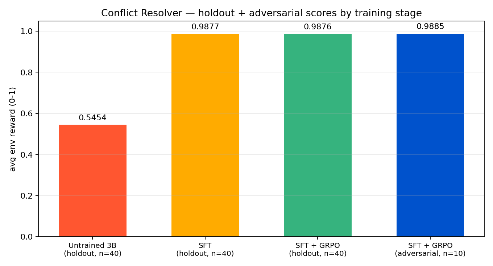

# personal assistant conflict resolver v2

**an OpenEnv RL environment that teaches LLMs to resolve cascading scheduling conflicts — with real world-state, partial observability, and follow-on conflicts triggered by the agent's own decisions.**

*OpenEnv Hackathon 2026 | Team Agent (1)*

## links (for judges)

- **live HF Space** (runnable env): [huggingface.co/spaces/srivtx/openenv-conflict-resolver-v2](https://huggingface.co/spaces/srivtx/openenv-conflict-resolver-v2)
- **demo video (story, ~2 min)**: [youtube.com/watch?v=3jPYWWhIKNs](https://www.youtube.com/watch?v=3jPYWWhIKNs)
- **mini-blog (writeup)**: [`blog.md`](blog.md)
- **training notebook (Colab T4)**: [`notebooks/train_grpo_colab.ipynb`](notebooks/train_grpo_colab.ipynb)
- **source / GitHub**: [github.com/srivtx/openenv-conflict-resolver-v2](https://github.com/srivtx/openenv-conflict-resolver-v2)

---

## what the environment does

a multi-step conflict resolution loop with a mutable world state. each step the agent sees the current conflict (plus the visible calendar), emits one structured JSON action, and the env:

1. grades the action with a 6-component reward.
2. mutates the calendar on `reschedule_event` / `propose_plan` actions.
3. on a clarification case where the agent correctly asks, **keeps the same conflict at the front of the queue** and reveals the hidden info on the next step.
4. on any cascade-rule case, checks whether the action triggers the rule (e.g. reschedule past 18:00 with `owner=work`) and **appends a follow-on conflict** to the queue.
5. returns reward, observation, done, and reward components.

the action space is 6 intents × 6 owners × 4 priorities + slot + needs_clarification + message:

```json
{
  "intent": "reschedule_event",
  "owner": "work",
  "priority": "urgent",
  "proposed_slot": "20:30",
  "needs_clarification": false,
  "message_template": "Reschedule the incident review to 20:30 with owner confirmation."
}
```

---

## procedural episodes (not a fixed dataset)

`conflict_generator.generate_episode(seed, difficulty)` builds episodes from parameterized templates with random variation in times, owners, urgencies, and event names. the reachable state space is huge — every seed yields a different episode.

| difficulty | conflicts | clarifications | cascades |
|------------|-----------|----------------|----------|
| easy       | 3         | 0              | 0        |
| medium     | 5         | ~1             | 0        |
| hard       | 7         | ~2             | ~1       |

---

## world state across steps

`WorldState` lives across the whole episode and tracks:

- `calendar`: events with start/end/owner/locked. **mutated** when the agent reschedules or proposes a plan.
- `pending_clarifications`: queued info reveals waiting to come back.
- `revealed_info`: `conflict_id → revealed text`.
- `cascade_queue`: follow-on conflicts the agent's own actions have spawned.

the conflict queue is dynamic, not a fixed array index — conflicts can be re-presented (after a clarification reveal), and new conflicts can be appended mid-episode (when a cascade rule fires).

---

## two-step partial observability

when a conflict has a `ClarificationSpec` and the agent picks `ask_clarification`:

1. **step N** — env scores the ask, records the revealed info on the case, and **keeps the same conflict at the front of the queue.**
2. **step N+1** — env re-presents the same conflict with `revealed_info` attached to the summary, and grades the post-reveal action.
3. **step N+2** — queue advances to the next conflict.

picking `ask_clarification` when no clarification is warranted triggers a `clarification_spam` penalty. the "ask everything to be safe" path is closed.

---

## real cascades

every procedural template can carry a `CascadeRule`. hard-difficulty episodes include a reschedule case where pushing the slot past 18:00 with `owner=work` spawns a follow-on "school pickup uncovered" conflict. the new conflict goes onto the queue and gets resolved like any other — **the agent's own decision generates the next problem.**

the unit tests assert a cascade fires under perfect-play oracles for `seed=42` (`test_cascade_appends_followup_conflict`).

---

## reward design

six weighted components, summing to 1.0. each is in `[0, 1]`; a per-component contribution is naturally capped at its weight. full derivation lives in [`graders.py`](src/assistant_conflict_env/graders.py).

| component       | weight | what it checks                                                          |
|-----------------|--------|--------------------------------------------------------------------------|
| `intent`        | 0.40   | exact match on action category — most consequential decision           |
| `owner`         | 0.20   | exact match on responsible principal                                    |
| `slot`          | 0.20   | regex-strict 24h `HH:MM`; time-distance scoring                         |
| `priority`      | 0.10   | partial credit (0.5) for off-by-one — adjacent priorities are defensible |
| `clarification` | 0.05   | boolean alignment with the case's `block_if_missing_context`             |
| `message`       | 0.05   | structural proxy: length + on-topic verb + word-diversity               |

**slot scoring** is regex-strict 24h `HH:MM` parsing with time-distance scoring (exact = 1.0, ≤30 min = 0.7, ≤60 min = 0.4, ≤120 min = 0.2, else 0.0).

**message scoring** is length + on-topic verb + word-diversity. a real on-topic sentence scores 1.0; a keyword-stuffed string scores ~0.5.

**anti-hacking penalties** (subtracted from the score, no floor — a fully wrong action can score `0.0`):

- `repetitive_intent` (−0.10) — same intent three steps in a row
- `premature_finalize` (−0.15) — `finalize_itinerary` while >1 conflict still pending
- `terminal_early` (−0.05) — any other terminal-style intent used to short-circuit
- `missing_slot` (−0.05) — `require_slot=True` but no slot supplied
- `clarification_spam` (−0.05) — asking when not warranted
- `short_message` (−0.04) — message under 16 chars

reward band is `[0.0, 1.0]`.

---

## train / holdout / adversarial split

pools are disjoint *by construction* — asserted at module import via `assert_split_disjoint()`:

| pool          | seed range  | size  | purpose                                          |
|---------------|-------------|-------|--------------------------------------------------|
| train         | 1000-1999   | 1000  | SFT data + GRPO rollouts                         |
| holdout       | 9000-9099   |  100  | honest generalization eval                       |
| adversarial   | 5000-5009   |   10  | probes the rebuilt grader's anti-shortcut behavior |

every episode is deterministic from its seed, so the split is reproducible from any commit.

---

## training results

honest numbers from a Colab T4 run on procedural episodes generated at eval time (the model has never seen these seeds during training):



| pool                | untrained 3B | after SFT | after SFT + GRPO |
|---------------------|--------------|-----------|------------------|
| holdout (n=40)      | **0.5454**   | **0.9877**| **0.9876**       |
| adversarial (n=10)  | —            | —         | **0.9885**       |

- **+0.4423** absolute lift on holdout from untrained → SFT. the model learns format and intent routing on procedurally-novel episodes.
- **GRPO ≈ SFT** here (0.9876 vs 0.9877). on hard procedural episodes the SFT stage is doing most of the lifting; GRPO holds the score steady, not collapsing it. reported as-is.
- **adversarial pool: 0.9885** with the final model. holds up on the probe seeds.

### grader sanity probes

verifying the slot and message scorers behave as designed:

```
slot-score probe:
  hint='after 20:30'   slot='later today'              -> 0.00
  hint='after 20:30'   slot='3pm tomorrow'             -> 0.00
  hint='20:30'         slot='reschedule to 20:30'      -> 1.00
  hint='20:30'         slot='21:00'                    -> 0.70   (30 min off, partial credit)
  hint='20:30'         slot='08:00'                    -> 0.00

message-score probe:
  STUFFED : 0.50  ('reschedule, work, urgent.')
  REAL    : 1.00  ('Reschedule the incident review to 20:30 with owner confirmation and follow up note.')
```

deterministic, regex-strict, no substring shortcuts.

to reproduce: open the Colab notebook, set runtime to T4, run all cells. the notebook prints holdout averages, the adversarial pool number, and these grader probes at the end. the final three cells render `assets/sft_loss.png`, `assets/grpo_reward_loss.png`, and `assets/score_comparison.png` directly from `sft_trainer.state.log_history` / `grpo_trainer.state.log_history`, so a fresh run produces the same evidence chart shown above.

---

## local setup

```bash
python -m venv .venv
source .venv/bin/activate
pip install -r requirements.txt

# Run the env API (does NOT need transformers/peft)
uvicorn assistant_conflict_env.server:app --app-dir src --host 0.0.0.0 --port 7860

# Run the unit tests (14 tests; covers world-state, cascades, clarifications, adversarial probes)
pytest -q
```

to run inference locally with the trained Qwen 3B + LoRA adapter:

```bash
pip install -r requirements-inference.txt   # heavy deps; only for local model loading

export MODEL_PATH=Qwen/Qwen2.5-3B-Instruct
export LORA_PATH=./trained_conflict_resolver  # path produced by the notebook
export EVAL_POOL=holdout                      # or 'adversarial' / 'static'
export EVAL_LIMIT=20

python inference.py
```

`inference.py` priority order:
1. `MODEL_PATH` set → load local HF model + optional LoRA via `transformers` / `peft`.
2. `HF_TOKEN` set (and no `MODEL_PATH`) → call HF Router with `MODEL_NAME` (default Qwen 2.5 3B Instruct).
3. neither set → heuristic-only baseline so the script still does something visible.

---

## stack

| component       | tool                                  | why                                    |
|-----------------|---------------------------------------|----------------------------------------|
| base model      | Qwen 2.5 3B Instruct                  | fits a free Colab T4                   |
| quantization    | 4-bit (BnB via Unsloth)               | 16GB VRAM constraint                   |
| fine-tuning     | LoRA (r=16, ~1% params)               | efficient adaptation                   |
| SFT             | TRL `SFTTrainer`                      | teaches JSON output format             |
| RL              | TRL `GRPOTrainer` with env reward     | optimizes decision quality             |
| acceleration    | Unsloth                               | 2x faster training                     |
| environment     | OpenEnv (`reset` / `step` / `state`)  | standard RL interface                  |
| deployment      | Docker + FastAPI                      | HF Spaces compatible                   |
| local inference | `transformers` + `peft`               | loads trained 3B + LoRA on user GPU    |

---

## theme alignment

- **theme 3.2 — personalized tasks**: the env models a single user's chaotic afternoon (work calendar, family logistics, finance/legal). personalization lives in the templates and constraints.
- **theme 2 — long-horizon planning**: state is carried across steps via `WorldState`; cascade conflicts depend on the agent's own past actions; clarifications take a 2-step ask-then-act loop. the unit tests assert all of this.

---

## project structure

```
round2/
├── README.md                           <- you are here
├── blog.md                             <- mini-blog for submission
├── Dockerfile
├── openenv.yaml
├── inference.py                        <- model evaluation (local LoRA / HF Router / heuristic)
├── requirements.txt                    <- env server deps (slim)
├── requirements-inference.txt          <- heavy deps for local inference only
├── src/
│   └── assistant_conflict_env/
│       ├── environment.py              <- queue-based env with WorldState
│       ├── conflict_generator.py       <- procedural template-based generator
│       ├── eval_set.py                 <- train / holdout / adversarial seed pools
│       ├── graders.py                  <- documented 6-component reward
│       ├── models.py                   <- pydantic data models incl. WorldState
│       ├── tasks.py                    <- static + procedural task resolver
│       ├── server.py                   <- FastAPI endpoints
│       └── fixtures/
│           └── conflict_cases.json     <- static demo tasks (UI only, not training)
├── notebooks/
│   └── train_grpo_colab.ipynb          <- procedural SFT + GRPO + holdout eval
├── docs/                               <- internal notes (not part of submission)
└── tests/
    ├── test_environment.py
    ├── test_graders.py
    └── test_world_state.py             <- cascades, clarifications, adversarial probes
```

---

## reproducing demo and eval

for the demo video, the recommended seed is **42** (used in the test suite):

```bash
python -c "
import asyncio
from src.assistant_conflict_env.environment import PersonalAssistantConflictEnv
async def go():
    env = PersonalAssistantConflictEnv()
    r = await env.reset(task_name='proc_hard_42')
    print(r.observation.current_conflict.summary)
asyncio.run(go())
"
```

---

*built with Unsloth and TRL.*
